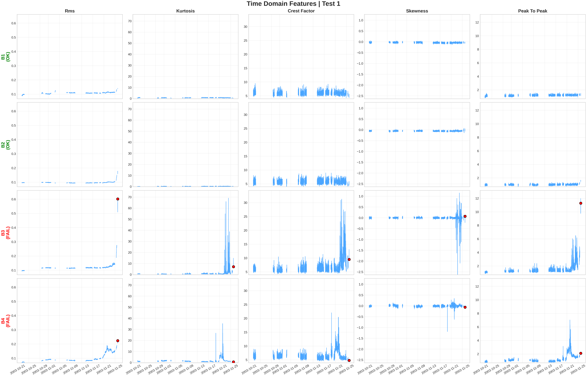
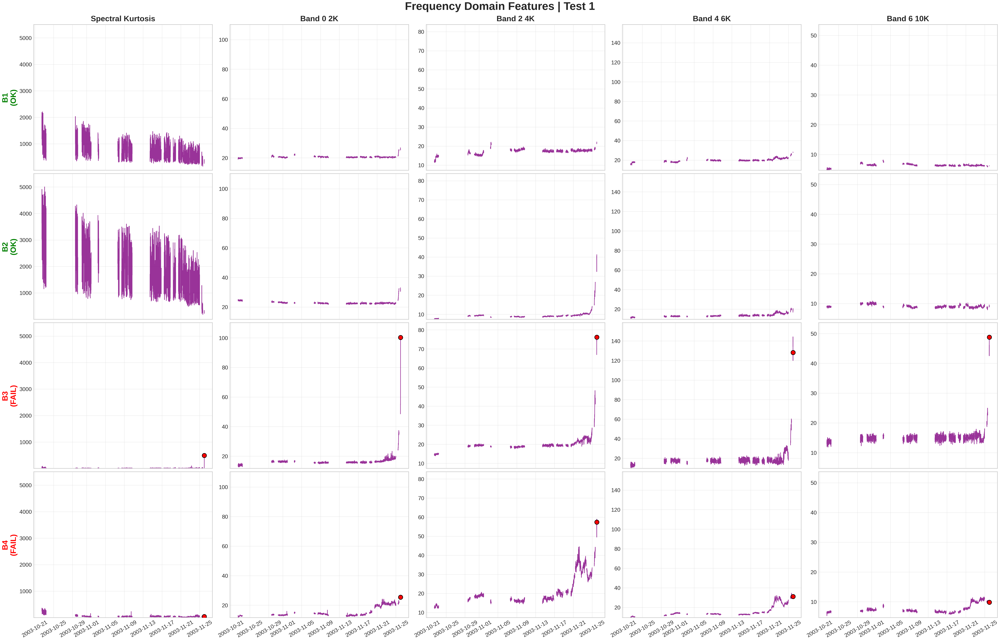
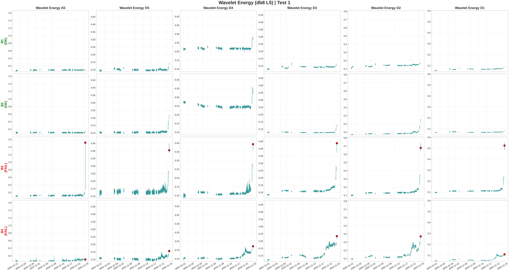
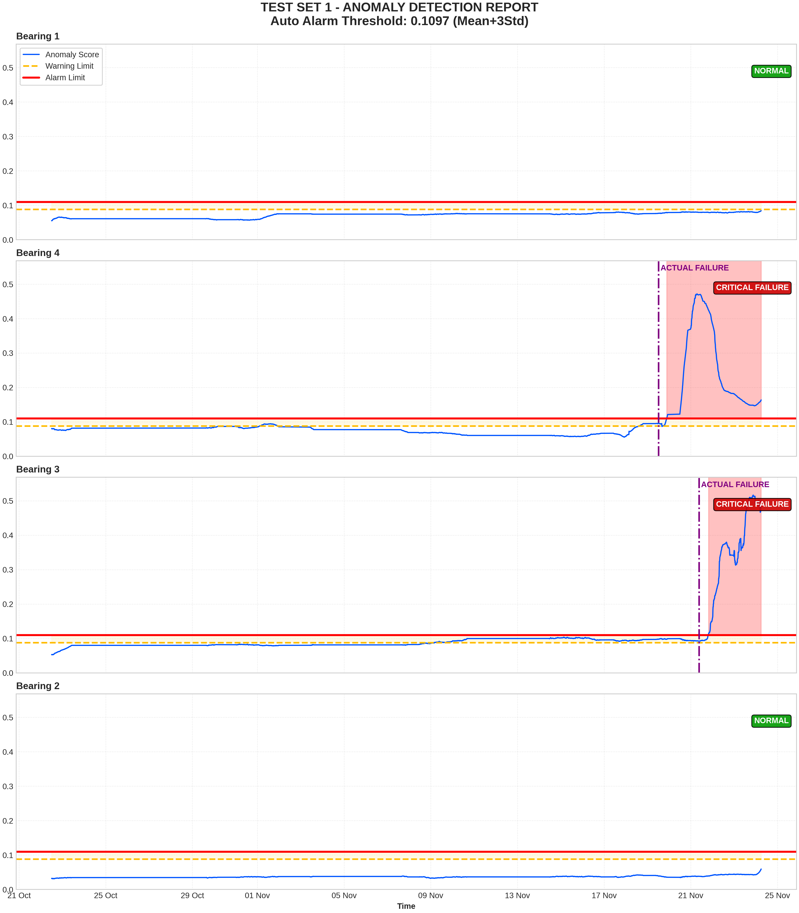
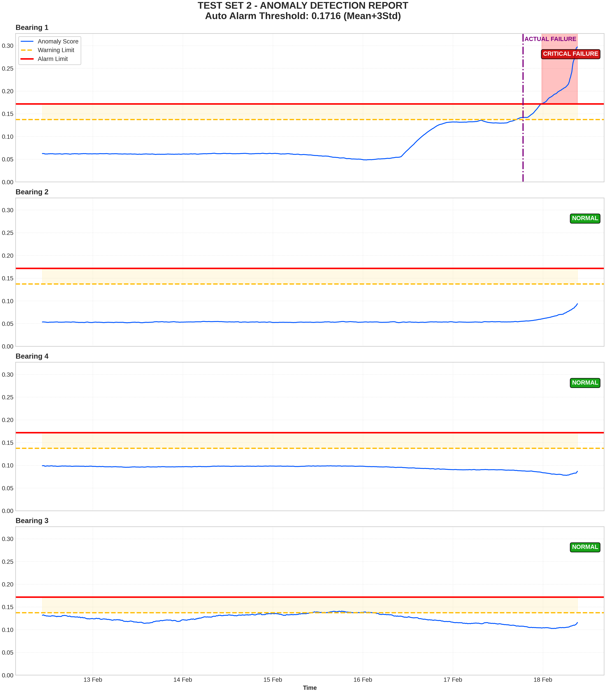
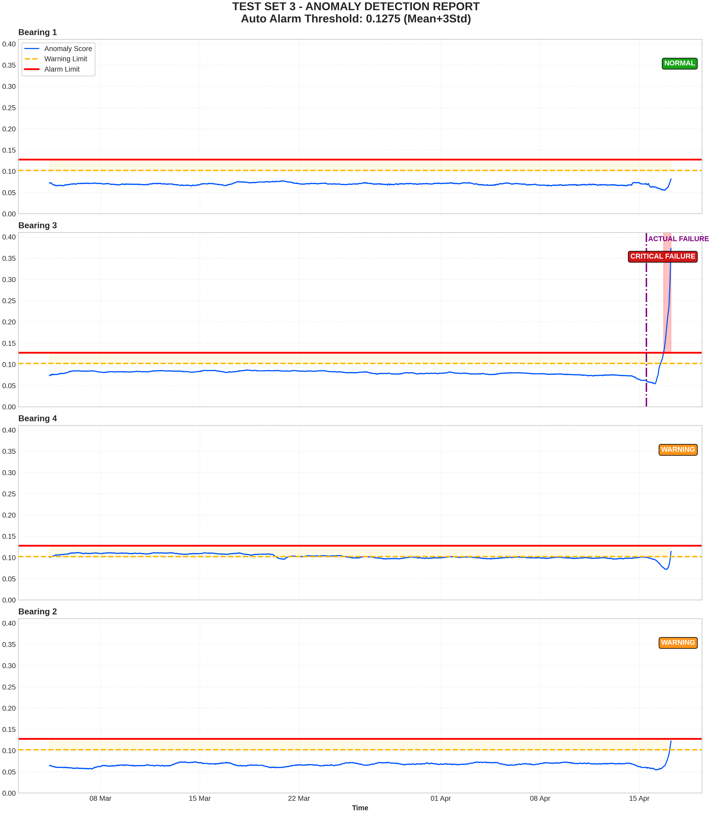

<div align="center">


# Unsupervised Anomaly Detection in Rotating Machinery Components Using LSTM Autoencoders

[](https://www.python.org/)
[](https://tensorflow.org/)
[](https://jupyter.org/)
[](LICENSE)

**End-to-End Predictive Maintenance Framework on NASA IMS Bearing Dataset**

</div>

---

## 1. Abstract

This study presents an end-to-end predictive maintenance system designed to detect early-stage faults in industrial rotating machinery components (bearings). Using the **NASA IMS Bearing Dataset**, a hybrid feature extraction methodology combining Time-Domain, Fast Fourier Transform (FFT), and Discrete Wavelet Transform (DWT) techniques was applied. The resulting high-dimensional signal features are fed into a semi-supervised **LSTM (Long Short-Term Memory) Autoencoder** model that learns the "healthy" operating conditions of the machine. The system detects anomalies by monitoring reconstruction error, providing a robust solution for Industry 4.0 condition monitoring systems.

## 2. Methodology and System Architecture

The proposed architecture is implemented in three main phases: Data Preprocessing, Feature Engineering, and Model Training.

### 2.1. Data Acquisition and High-Performance ETL
The raw dataset consists of discrete ASCII files generated at 10-minute intervals. To overcome I/O bottlenecks and ensure data integrity, an optimized **PyArrow-based ETL pipeline** was developed.

* **Input:** High-frequency vibration signals sampled at 20 kHz.
* **Processing:** Time synchronization, continuity analysis, and metadata extraction.
* **Output:** Data is converted to partitioned **Apache Parquet** format to enhance query performance during training iterations and optimize memory management.

### 2.2. Feature Engineering Strategy
Due to the high dimensionality and non-stationary nature of raw signals, dimensionality reduction was performed using advanced signal processing techniques.

| Domain | Technique | Extracted Key Features |
| :--- | :--- | :--- |
| **Time** | Statistical Moments | **RMS** (Energy), **Kurtosis** (Flatness/Impulsiveness), **Skewness**, Crest Factor, Peak-to-Peak. |
| **Frequency** | FFT (Fast Fourier Transform) | Power density in specific bands: **0-2kHz** (Low), **2-10kHz** (Fault characteristic bands), **Spectral Kurtosis**. |
| **Time-Frequency** | DWT (Discrete Wavelet Transform) | Energy distribution using **Daubechies 8 (db8)** mother wavelet with **5-level decomposition**. |

### 2.3. Deep Learning Model: LSTM Autoencoder
The core of the anomaly detection system is a sequence-to-sequence LSTM Autoencoder. The model is trained exclusively on healthy data to learn the normal operation manifold.

**Network Topology:**
The architecture compresses the input time series $X$ into a fixed-size latent vector ($Z$) via the Encoder and reconstructs it as $\hat{X}$ via the Decoder.

* **Input Layer:** `(Window_Size=128, Number_of_Features=6)`
* **Encoder:** LSTM (64 units) $\rightarrow$ LSTM (32 units) $\rightarrow$ Latent Representation $Z$
* **Decoder:** LSTM (32 units) $\rightarrow$ LSTM (64 units) $\rightarrow$ Output $\hat{X}$

**Loss Function:**
During training, the model optimizes the Mean Squared Error (MSE) to minimize reconstruction error:

$$L(x, \hat{x}) = \frac{1}{N} \sum_{i=1}^{N} || x_i - \hat{x}_i ||^2$$

During inference, samples with $L(x, \hat{x})$ exceeding a statistically determined threshold are classified as anomalies.

---

## 3. Experimental Results and Performance

### 3.1. Feature Analysis
The figures below show the evolution of extracted features as the component approaches failure.

<div align="center">
  
  <p><em>Figure 1: Time Domain – Exponential increase in RMS and Kurtosis values near the end of bearing life.</em></p>
</div>

<div align="center">
  
  <p><em>Figure 2: Frequency Domain – Energy shift in the 2-6 kHz band as outer race fault progresses.</em></p>
</div>

<div align="center">
  
  <p><em>Figure 3: Wavelet – High-sensitivity energy decomposition for early-stage faults.</em></p>
</div>

### 3.2. Automatically Generated Anomaly Reports
The final outputs generated by the system on test sets are shown below. The model successfully detects faults using a **Dynamic Threshold (Mean + 3 Std)** mechanism.

#### Test Set 1: Synchronous Critical Failure
A sudden, synchronized fault occurs in Bearing 3 and Bearing 4. The blue line (Anomaly Score) sharply exceeds the red alarm threshold at the fault moment.

<div align="center">
  
  <p><em>Visual Report 1: Sudden shock effect and synchronized threshold exceedance.</em></p>
</div>

#### Test Set 2: Gradual Degradation (Early Warning)
This represents the ideal scenario for predictive maintenance. The anomaly score in Bearing 1 gradually increased days before the actual fault, providing time for intervention.

<div align="center">
  
  <p><em>Visual Report 2: Early detection of gradual wear trend.</em></p>
</div>

#### Test Set 3: Fault Propagation
While Bearing 3 experiences the main failure (Critical Level), sympathetic warning levels are observed in Bearing 2 and 4 due to vibration propagation through the housing.

<div align="center">
  
  <p><em>Visual Report 3: Main fault source and propagated vibration effect.</em></p>
</div>

---

## 4. Directory Structure

The project is structured to support both script-based and interactive Notebook workflows.

```text
.
├── data/                   # Data storage (Raw and Processed Parquet)
├── figures/                # Analysis plots and visual reports
├── models/                 # Serialized models (.keras) and scalers (.pkl)
├── notebooks/              # Project execution and analysis files
│   ├── train_model.ipynb           # [STEP 1] Start model training
│   ├── test_model.ipynb            # [STEP 2] Model evaluation and anomaly scoring
│   └── visualization_results.ipynb # [STEP 3] Visualization and reporting of results
├── src/
│   └── predictive_maintenance/
│       ├── config.py       # Configuration (Hyperparameters, Paths)
│       ├── data.py         # ETL pipeline, Feature Extraction, and Data Loader
│       ├── models.py       # LSTM Autoencoder architecture and training loop
│       ├── visualization.py# Visualization utilities for signal analysis
│       └── __init__.py
├── pyproject.toml          # Project dependencies and metadata
├── requirements.txt        # Python package requirements
└── README.md

```

## 5. Installation and Usage

### Prerequisites
* Python 3.11+
* TensorFlow 2.14+

### Installation
Clone the repository and install dependencies:
```bash
git clone [https://github.com/seyhankokcu/predictive-maintenance-lstm.git](https://github.com/seyhankokcu/predictive-maintenance-lstm.git)
cd predictive-maintenance-lstm
pip install -r requirements.txt
```

### Execution Steps
The project is designed as a stepwise pipeline. Run the files in the `notebooks/` folder sequentially to obtain results:

#### Step 1: Model Training
Run `notebooks/train_model.ipynb`.
* Function: Processes the data, trains the LSTM Autoencoder on healthy data, and saves the model in the `models/` folder.

#### Step 2: Testing and Evaluation
Run `notebooks/test_model.ipynb`.
* Function: Loads the trained model, calculates reconstruction errors (MAE) on test sets, and saves results in CSV format.

#### Step 3: Visualization and Reporting
Run `notebooks/visualization_results.ipynb`.
* Function: Reads calculated anomaly scores, computes Dynamic Threshold (Mean + 3 Std), and outputs detailed anomaly plots for each bearing to the `figures/` folder.

## 6. License
This project is licensed under the MIT License. See the LICENSE file for details.